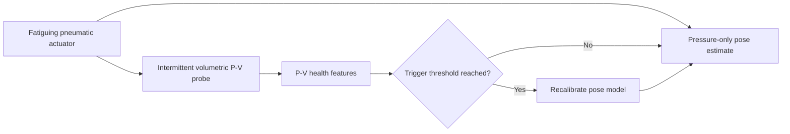

# P-V Fatigue Manifold Proprioception

[](https://github.com/500ft/P-V-Fatigue-Manifold-Proprioception/actions/workflows/ci.yml)
[](https://github.com/500ft/P-V-Fatigue-Manifold-Proprioception/releases/tag/preprint-v1.3)
[](https://www.python.org/)

A Python simulation study of pressure-volume loop features as recalibration
signals for pressure-only proprioception in soft pneumatic actuators.

**[Results](#results) · [Quick start](#quick-start) · [Research scope](#research-scope) · [Documentation](#documentation) · [Citation](#citation)**


*Held-out pose error versus lifetime recalibration count for fixed,
cycle-scheduled, P-V-triggered, and always-on policies.*

## Overview

Soft pneumatic actuators drift as they fatigue. Recalibrating continuously can
control that drift, but it adds sensing and operating cost. This repository
tests whether an intermittent P-V probe can schedule recalibration only when the
actuator needs it.

| | |
| --- | --- |
| **Study type** | Simulation with held-out synthetic actuators |
| **Main comparison** | P-V-triggered, cycle-count, fixed, and always-on policies |
| **Current release** | Simulation-only preprint v1.3 |
| **Physical testing** | Not yet performed |
| **Outputs** | Study data, figures, manuscript, and publication checks |

## How it works



The pose estimator remains pressure-only during normal operation. The health
signal comes from a separate intermittent P-V loop, so the study evaluates a
recalibration policy rather than continuous volume sensing.

## Results

| Result | Current output |
| --- | --- |
| Dataset | 2,000 synthetic traces split by actuator identity |
| P-V association | Pooled `r = 0.885`; the v1 point-level bootstrap interval is `[0.835, 0.958]` |
| Recalibration policy | 2 recalibrations per actuator for the P-V policy versus 5 for always-on |
| Cycle-count baseline | Misses the registered error budget on held-out actuators at equal tuning |
| Trigger lead | The deployed threshold has zero positive temporal lead |
| Shared-manifold cross-talk | Second-order within the tested simulation envelope |

The v2 analysis plan replaces point-level resampling with actuator-cluster
resampling and leave-one-actuator-out sensitivity. Results currently come from
one generative model and should not be read as physical actuator performance.

## Quick start

```bash
python -m venv .venv
source .venv/bin/activate
python -m pip install -r requirements.txt
python -m pip install pytest reportlab pypdf
python -m scripts.run_study3
```

Study 3 writes its generated data and figures under `data/sim/phaseD/`.

## Reproduce the release

```bash
python -m pytest
python -m scripts.check_manuscript_numbers
python -m scripts.check_pdf_arxiv
python -m scripts.check_publication_fallback
```

The checks compare manuscript values with committed study outputs, inspect the
PDF for arXiv constraints, and check the release metadata and file digest.

## Research scope

Previous work already uses before/after P-V hysteresis to assess pneumatic
actuator fatigue. This project instead evaluates:

1. life-stage P-V feature trajectories;
2. threshold-based recalibration scheduling;
3. pressure-only pose-estimation drift under fatigue; and
4. shared-manifold cross-talk inside the tested simulation envelope.

The frozen v1.3 manuscript is [`docs/preprint_v1.pdf`](docs/preprint_v1.pdf).
Ongoing paper revisions are tracked in
[`docs/REVISION_PLAN.md`](docs/REVISION_PLAN.md) without changing the tagged
release.

## Documentation

| Document | Purpose |
| --- | --- |
| [`docs/preprint_v1.md`](docs/preprint_v1.md) | Source for the simulation-only manuscript |
| [`docs/Experimental_Protocol.md`](docs/Experimental_Protocol.md) | Study gates, protocols, and operating sequence |
| [`docs/Simulation_Plan.md`](docs/Simulation_Plan.md) | Simulation phases and planned outputs |
| [`docs/A01_A04_Literature_Review.md`](docs/A01_A04_Literature_Review.md) | Prior work and citation notes |
| [`docs/SUBMISSION.md`](docs/SUBMISSION.md) | Release and submission runbook |
| [`ROADMAP.md`](ROADMAP.md) | Project milestones and remaining work |

## Repository map

```text
sim/        pneumatic plant, sensing, kinematics, and fatigue models
pipeline/   feature extraction, health indices, and recalibration logic
scripts/    study runners, figure generation, and publication checks
tests/      model, pipeline, and release regression tests
data/       committed study inputs, outputs, and figures
docs/       manuscript, protocol, literature review, and release notes
```

## Citation

Use [`CITATION.cff`](CITATION.cff) or the metadata attached to the
[`preprint-v1.3`](https://github.com/500ft/P-V-Fatigue-Manifold-Proprioception/releases/tag/preprint-v1.3)
release. The citation file points to the frozen manuscript version rather than
the changing development branch.

## Contributing

See [`CONTRIBUTING.md`](CONTRIBUTING.md) for setup, generated-artifact rules,
and the checks required before a change is submitted.

## License

- Source code is available under the [MIT License](LICENSE).
- Manuscript text, documentation, and figures are available under
  [CC BY 4.0](LICENSE-docs).

Copyright (c) 2026 Mergen Ulziibayar.
