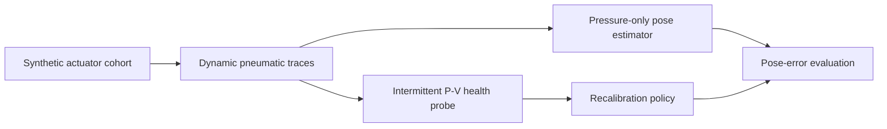

# P-V Fatigue Manifold Proprioception

[](https://github.com/500ft/P-V-Fatigue-Manifold-Proprioception/actions/workflows/ci.yml)
[](https://github.com/500ft/P-V-Fatigue-Manifold-Proprioception/releases/tag/preprint-v1.3)
[](https://www.python.org/)

A Python simulation study of pressure-volume loop features as recalibration
signals for pressure-only proprioception in soft pneumatic actuators.

**[Overview](#overview) · [Quick start](#quick-start) · [Reproduction](#reproduction) · [Documentation](#documentation) · [Citation](#citation)**


*A representative Study 3 output. See [results](docs/results.md) for the numerical
interpretation and [data and figure provenance](docs/data-and-figures.md#study-3-recalibration-policy)
for its complete generation path.*

## Overview

Soft pneumatic actuators drift as they fatigue. This repository tests whether an
intermittent P-V probe can schedule recalibration while the normal pose estimator
continues to use pressure alone.

| | |
| --- | --- |
| **Study type** | Simulation with held-out synthetic actuator identities |
| **Main comparison** | P-V-triggered, cycle-scheduled, fixed, and always-on recalibration |
| **Model layers** | Pneumatic network, viscoelastic wall, fatigue law, PCC kinematics, and sensors |
| **Primary artifact** | Simulation-only preprint v1.3 |
| **Physical testing** | Not included |



## Quick start

```bash
python -m venv .venv
source .venv/bin/activate
python -m pip install -r requirements.txt
python -m pip install pytest reportlab pypdf
python -m scripts.run_study3
```

Study 3 reads the committed Phase D dataset and writes its JSON and figures under
`data/sim/phaseD/`.

## Reproduction

Generate the complete Phase D synthetic dataset before rerunning its studies:

```bash
python -m scripts.phaseD_dataset
python -m scripts.run_study2
python -m scripts.run_study3
python -m scripts.run_study4
```

Run the release checks:

```bash
python -m pytest
python -m scripts.check_manuscript_numbers
python -m scripts.check_pdf_arxiv
python -m scripts.check_publication_fallback
```

The numerical findings and their boundaries are in [`docs/results.md`](docs/results.md).
Every computational figure is grouped by generator, input, command, and evidence
type in [`docs/data-and-figures.md`](docs/data-and-figures.md). The corresponding
machine-readable registry is [`docs/figure-manifest.json`](docs/figure-manifest.json).

## Documentation

| Document | Purpose |
| --- | --- |
| [`docs/results.md`](docs/results.md) | Result summary and links to detailed study outputs |
| [`docs/data-and-figures.md`](docs/data-and-figures.md) | Dataset and plot generation lineage |
| [`docs/preprint_v1.md`](docs/preprint_v1.md) | Manuscript source |
| [`docs/Experimental_Protocol.md`](docs/Experimental_Protocol.md) | Study gates and operating protocol |
| [`docs/Simulation_Plan.md`](docs/Simulation_Plan.md) | Simulation phases and planned outputs |
| [`docs/A01_A04_Literature_Review.md`](docs/A01_A04_Literature_Review.md) | Prior work and citation notes |
| [`docs/SUBMISSION.md`](docs/SUBMISSION.md) | Release and submission runbook |
| [`ROADMAP.md`](ROADMAP.md) | Project milestones |

## Repository map

```text
sim/        pneumatic plant, sensing, kinematics, and fatigue models
pipeline/   feature extraction, health indices, and recalibration logic
scripts/    dataset, study, figure, and publication runners
tests/      model, pipeline, and release regression tests
data/       committed simulation inputs, outputs, and figures
docs/       results, provenance, manuscript, protocol, and literature
```

## Citation

Use [`CITATION.cff`](CITATION.cff) or the metadata attached to the
[`preprint-v1.3`](https://github.com/500ft/P-V-Fatigue-Manifold-Proprioception/releases/tag/preprint-v1.3)
release.

## Contributing and license

See [`CONTRIBUTING.md`](CONTRIBUTING.md). Source code is available under the
[MIT License](LICENSE); manuscript text, documentation, and figures are available
under [CC BY 4.0](LICENSE-docs).
