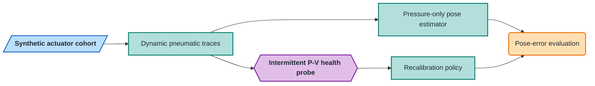

# P-V Fatigue Manifold Proprioception

[](https://github.com/500ft/P-V-Fatigue-Manifold-Proprioception/actions/workflows/ci.yml)
[](https://github.com/500ft/P-V-Fatigue-Manifold-Proprioception/releases/tag/preprint-v1.3)
[](https://www.python.org/)

**A Python simulation study of pressure-volume loop features as recalibration
signals for pressure-only proprioception in soft pneumatic actuators.**

**[Overview](#overview) · [Results](#results) · [Quick start](#quick-start) · [Reproduction](#reproduction) · [Status](#status) · [Documentation](#documentation) · [Citation](#citation)**


*A representative Study 3 output (simulation, held-out synthetic actuators — no
physical measurement). See [results](docs/results.md) for the numerical
interpretation and [data and figure provenance](docs/data-and-figures.md#study-3-recalibration-policy)
for its complete generation path.*

## Overview

Soft pneumatic actuators drift as they fatigue. This repository tests whether an
intermittent P-V probe can schedule recalibration while the normal pose estimator
continues to use pressure alone.

| | |
| --- | --- |
| **Study type** | Simulation with held-out synthetic actuator identities |
| **Main comparison** | P-V-triggered, cycle-scheduled, fixed, and always-on recalibration |
| **Model layers** | Pneumatic network, viscoelastic wall, fatigue law, PCC kinematics, and sensors |
| **Primary artifact** | Simulation-only preprint v1.3 |
| **Physical testing** | Not included |



*Shapes: parallelogram = input · rectangle = process · hexagon = core method · rounded = result.*

## Results

Evidence state for every number below: **simulation** on held-out synthetic
actuators; there is no physical testing in this repository. Each value is stored
in a committed study JSON under `data/sim/` and asserted against the manuscript
by `scripts/check_manuscript_numbers.py`.

| Finding (Study 3, held-out synthetic actuators) | Committed value |
| --- | --- |
| P-V loop area as a fatigue health indicator | pooled `r = 0.885`, actuator-cluster bootstrap `[0.853, 0.950]` |
| P-V-triggered recalibration vs. always-on | meets the registered error budget with 2 recalibrations per actuator vs. 5 |
| Temporal lead at the deployed threshold `tau = 0.05` | none (negative finding); lower thresholds buy lead at higher recalibration cost |

The boundaries of these claims, including the negative findings, are in
[`docs/results.md`](docs/results.md).

## Quick start

```bash
python -m venv .venv
source .venv/bin/activate
python -m pip install -r requirements.txt
python -m pip install pytest reportlab pypdf
python -m scripts.phaseD_dataset
python -m scripts.run_study3
```

The Phase D dataset arrays are intentionally not committed:
`scripts.phaseD_dataset` regenerates them deterministically in about a minute,
and the committed [`data/sim/phaseD/manifest.json`](data/sim/phaseD/manifest.json)
pins the expected SHA-256. Study 3 then writes its JSON and figures under
`data/sim/phaseD/`.

## Reproduction

Generate the complete Phase D synthetic dataset before rerunning its studies:

```bash
python -m scripts.phaseD_dataset
python -m scripts.run_study2
python -m scripts.run_study3
python -m scripts.run_study4
```

Run the release checks:

```bash
python -m pytest
python -m scripts.check_manuscript_numbers
python -m scripts.check_pdf_arxiv
python -m scripts.check_publication_fallback
```

The numerical findings and their boundaries are in [`docs/results.md`](docs/results.md).
Every computational figure is grouped by generator, input, command, and evidence
type in [`docs/data-and-figures.md`](docs/data-and-figures.md). The corresponding
machine-readable registry is [`docs/figure-manifest.json`](docs/figure-manifest.json).

## Status

Studies 1–4 are complete, and manuscript v1.3 is frozen and tagged as
[`preprint-v1.3`](https://github.com/500ft/P-V-Fatigue-Manifold-Proprioception/releases/tag/preprint-v1.3),
with CI gating the tests, the manuscript-number checks, and the release PDF.
Preprint posting is **pending**: arXiv submission awaits endorsement, and no
arXiv identifier or DOI exists yet (runbook:
[`docs/SUBMISSION.md`](docs/SUBMISSION.md), fallback:
[`docs/ZENODO_FALLBACK.md`](docs/ZENODO_FALLBACK.md)). Physical validation has
not started; every claim is scoped to the synthetic generator.

## Documentation

| Document | Purpose |
| --- | --- |
| [`docs/results.md`](docs/results.md) | Result summary and links to detailed study outputs |
| [`docs/data-and-figures.md`](docs/data-and-figures.md) | Dataset and plot generation lineage |
| [`docs/preprint_v1.md`](docs/preprint_v1.md) | Manuscript source |
| [`docs/Experimental_Protocol.md`](docs/Experimental_Protocol.md) | Study gates and operating protocol |
| [`docs/A01_A04_Literature_Review.md`](docs/A01_A04_Literature_Review.md) | Prior work and citation notes |
| [`docs/SUBMISSION.md`](docs/SUBMISSION.md) | Release and submission runbook |

## Repository map

```text
sim/        pneumatic plant, sensing, kinematics, and fatigue models
pipeline/   feature extraction, health indices, and recalibration logic
scripts/    dataset, study, figure, and publication runners
tests/      model, pipeline, and release regression tests
data/       committed simulation inputs, outputs, and figures
docs/       results, provenance, manuscript, protocol, and literature
```

## Citation

Use [`CITATION.cff`](CITATION.cff) or the metadata attached to the
[`preprint-v1.3`](https://github.com/500ft/P-V-Fatigue-Manifold-Proprioception/releases/tag/preprint-v1.3)
release.

## Contributing and license

See [`CONTRIBUTING.md`](CONTRIBUTING.md). Source code is available under the
[MIT License](LICENSE); manuscript text, documentation, and figures are available
under [CC BY 4.0](LICENSE-docs).
