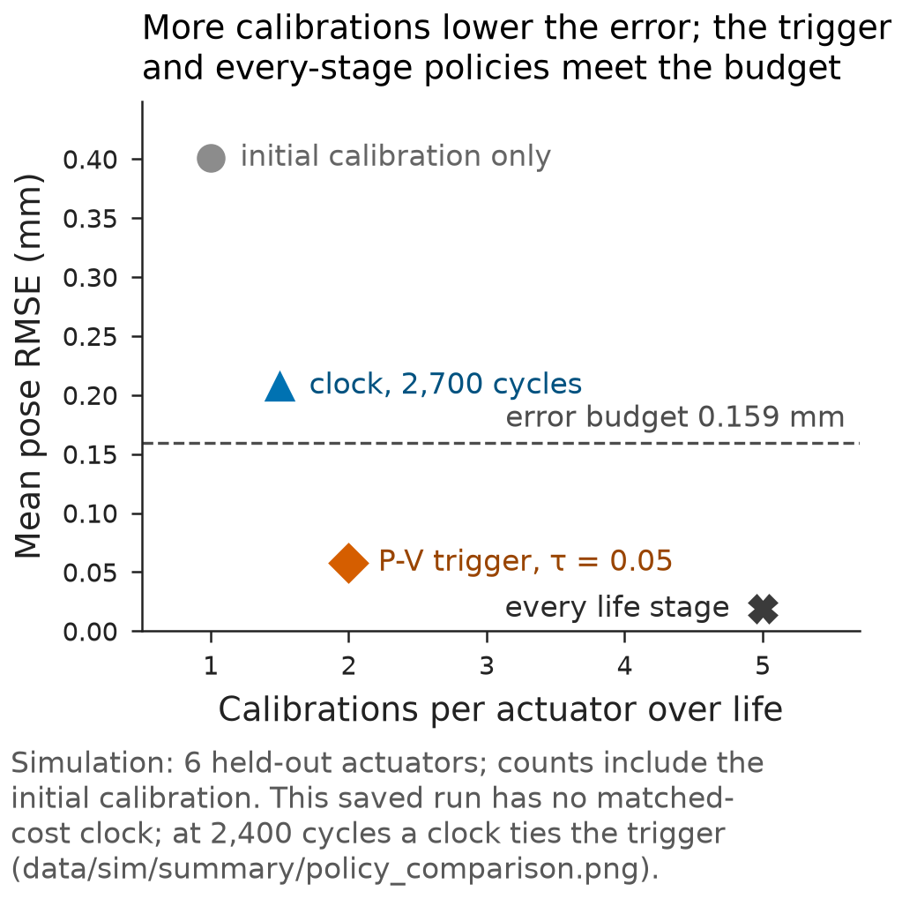

# Soft Actuator Recalibration

**When should a soft robot recalibrate?** A soft pneumatic actuator can
estimate its pose from pressure alone, but that estimate drifts as the silicone
fatigues. This repository simulates 20 actuators and tests whether a
pressure–volume (P-V) probe can say when to recalibrate. In this simulator it
does no better than counting cycles: at the same number of recalibrations, a
cycle-count clock matches the P-V trigger exactly. Everything here is
simulation; no physical actuator has been measured.

> **No paper.** The archived v1.3 manuscript overstated the method (see the
> [correction](docs/corrections/v1.3-methods-2026-09-05.md)). The v1.4
> candidate was withdrawn on 2026-10-02 because its main claim doesn't survive a
> comparison at matched cost ([withdrawal note](docs/corrections/v1.4-withdrawn-2026-10-02.md)).
> The code and the original results are kept.

[](https://github.com/500ft/soft-actuator-recalibration/actions/workflows/ci.yml)
[](docs/results.md)
[](.github/workflows/ci.yml)

[Results](#results) · [Roadmap](ROADMAP.md) · [Quick start](#quick-start) ·
[Review packet](docs/REVIEW_READY.md)



*Study 3: four recalibration policies on six held-out simulated actuators. The
clock shown is the train-selected 2,700-cycle one; a clock every 2,400 cycles
lands exactly on the triggered point. [How the plot was made](docs/data-and-figures.md#study-3-recalibration-policy).*

## About

Recalibrating often keeps pose error low but costs calibration events; waiting
too long lets the error grow. The study simulates 20 actuators through five
life stages (2,000 traces), splits them by actuator for training and testing,
and compares four policies: never recalibrate, recalibrate on a cycle-count
schedule, recalibrate when the P-V probe crosses a threshold, and recalibrate
at every stage.

The repository holds the pneumatic simulator, the fatigue and sensing models,
the pose estimators, the study scripts, and the results and figures they
produced.

## Results

| Question | Answer | Source |
| --- | --- | --- |
| Does the P-V trigger beat counting cycles? | No. It meets the 0.159 mm budget with 2 recalibrations per actuator against 5 for always-on (0.058 mm), but a clock every 2,400 cycles gives exactly the same schedule and error. The 2,700-cycle clock Study 3 reported uses fewer recalibrations and misses the budget (0.21 mm). | [Audit](data/sim/phaseD/matched_clock_audit.json), [Study 3](data/sim/phaseD/study3_results.json) |
| Does the trigger warn before the error passes the budget? | No. At the chosen threshold (τ = 0.05) it fires at 0.83 of life; the budget is passed at a median 0.71. That is a lead of −0.123 of life, late on all 6 held-out actuators. A lower threshold (τ = 0.01) fires early, median +0.346, at 3 recalibrations. | [Results](docs/results.md#study-3-recalibration-policy) |
| Does the P-V loop track the drift? | Only by construction. r = 0.885 (95% interval 0.853–0.950 by actuator), but in this simulator normalized loop area is the compliance multiplier that drives the drift, read back out. | [Audit](data/sim/phaseD/matched_clock_audit.json), [Cluster results](data/sim/phaseD/study3_cluster_ci_results.json) |
| What causes most of the pose error? | Fatigue drift in compliance. With a calibration made when the actuator was new, curvature error grows about a hundredfold over its life. Cross-talk through the shared air supply is second-order; a dynamic corrector for it improves error by about 0%. | [Results](docs/results.md#study-4-shared-manifold-sensitivity) |
| Can pressure alone reveal fatigue across different actuators? | Not reliably. Study A passes only under an amended rule, Study B's post-onset precision is not established (its two resolution figures were withdrawn), and Study C's life estimator fails its transfer test. | [Observability studies](docs/specs/observability-program/program.md) |

## Quick start

Python 3.11, the CI version. These commands run the tests and check the saved
results and manuscripts; they don't rerun the studies.

```bash
git clone https://github.com/500ft/soft-actuator-recalibration.git
cd soft-actuator-recalibration
python -m venv .venv
source .venv/bin/activate
python -m pip install -r requirements.txt pytest reportlab pypdf
python -m pytest -q
python -m scripts.check_manuscript_numbers
python -m scripts.check_pdf_arxiv
python -m scripts.check_publication_fallback
```

The number check covers the v1.3 and v1.4 manuscripts. The PDF check covers the
archived v1.3 PDF only. The last command checks the archive; run it with
`--for-publication` and it exits with code 2 (BLOCKED), which is now permanent.
To reproduce the matched-cost audit, regenerate the dataset with
`python -m scripts.phaseD_dataset`, then run `python -m scripts.audit_matched_clock`.

To rerun the studies, see the
[reviewer guide](docs/START_HERE.md#reviewer-reproduce-the-checks). The study
scripts write under `data/`, so use a separate checkout.

## What's next

Nothing, for this version. The paper is stopped and the code is kept. A
hardware study, a real chamber cycled to failure with rest time and temperature
varied, would be a new project rather than a step toward this paper. See the
[roadmap](ROADMAP.md).

## Limits

- All 20 actuators come from one simulated fatigue model. Held-out actuators
  test robustness to that model, not to real device-to-device variation, and no
  physical actuator was tested.
- Study 3's probe is idealized: noise-free, with no rest period, and generated
  by the same fatigue model as the drift it predicts. Probe noise and varying
  rest periods are untested.
- Five life stages can't show how the trigger behaves between them.
- The error budget is an average over life stages, not a worst case. Probe time
  and recalibration downtime were not measured.
- Absolute errors stay under a millimetre throughout, so triggered
  recalibration matters most where accuracy requirements are tight.

## Documentation

| Document | What it covers |
| --- | --- |
| [Reading guide](docs/START_HERE.md) | Short paths for readers, reviewers and contributors |
| [Results and limits](docs/results.md) | Every study's findings in full |
| [Data and figures](docs/data-and-figures.md) · [manifest](docs/figure-manifest.json) | Inputs and scripts behind each figure |
| [Review packet](docs/REVIEW_READY.md) · [v1.4 withdrawal](docs/corrections/v1.4-withdrawn-2026-10-02.md) · [v1.3 correction](docs/corrections/v1.3-methods-2026-09-05.md) | Why v1.4 was withdrawn and what v1.3 overstated |
| [Observability studies](docs/specs/observability-program/program.md) | Estimating fatigue from pressure across actuators |
| [Literature](literature/README.md) · [claim ledger](literature/claim-ledger.md) | Sources for and against each claim |

```text
sim/        pneumatic, fatigue, sensing and kinematic models
pipeline/   feature extraction, health signals and estimators
scripts/    study runners, plot generation and checks
tests/      model, policy, figure and publication tests
data/       committed synthetic results; the large dataset is regenerated
docs/       methods, results, manuscripts and review records
evidence/   recorded checks
```

## Contributing, citation and license

Read [CONTRIBUTING.md](CONTRIBUTING.md) before changing code or results. When
reporting a problem, include the command, the source revision, and what you
expected and saw.

[CITATION.cff](CITATION.cff) still describes the v1.3 manuscript. If you cite
it, name the version and mention the [correction](docs/corrections/v1.3-methods-2026-09-05.md).
The repository was renamed; the paper title was not
([identity note](docs/REPOSITORY_IDENTITY.md)).

Code is [MIT](LICENSE). Manuscript text, documentation and figures are
[CC BY 4.0](LICENSE-docs). Superseded publication instructions are preserved in
[submission notes](docs/SUBMISSION.md) and [Zenodo notes](docs/ZENODO_FALLBACK.md).
