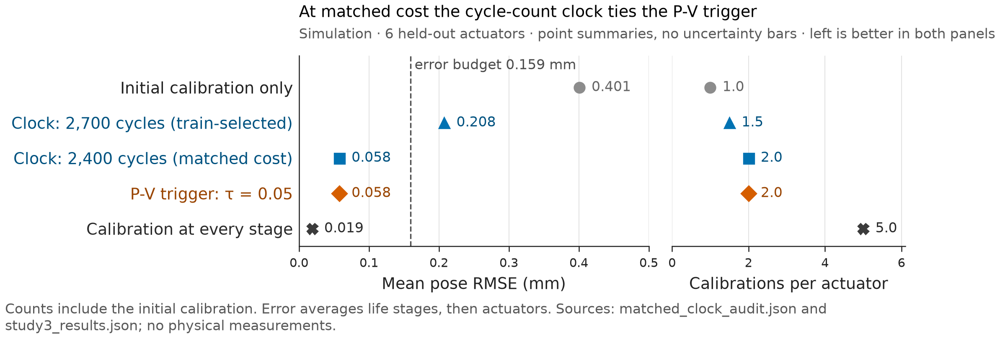

# Soft Actuator Recalibration

**When should a soft robot recalibrate?** This closed simulation study models
a pressure-based pose estimate that drifts with assumed fatigue. It simulates
20 actuators and tests whether a
pressure–volume (P-V) probe can say when to recalibrate. In this simulator it
does no better than counting cycles: at the same number of recalibrations, a
cycle-count clock matches the P-V trigger exactly. Everything here is
simulation; no physical actuator has been measured.

> **No paper.** The archived v1.3 manuscript overstated the method (see the
> [correction](docs/corrections/v1.3-methods-2026-09-05.md)). The v1.4
> candidate was withdrawn on 2026-10-02 because its main claim doesn't survive a
> comparison at matched cost ([withdrawal note](docs/corrections/v1.4-withdrawn-2026-10-02.md)).
> The code and the original results are kept.

[](https://github.com/500ft/soft-actuator-recalibration/actions/workflows/ci.yml)
[](docs/results.md)
[](.github/workflows/ci.yml)

[Results](#results) · [Roadmap](ROADMAP.md) · [Quick start](#quick-start) ·
[Review packet](docs/REVIEW_READY.md)

## About

Recalibrating often keeps pose error low but costs calibration events; waiting
too long lets the error grow. The study simulates 20 actuators through five
life stages (2,000 traces), splits them by actuator for training and testing,
and compares four policies: never recalibrate, recalibrate on a cycle-count
schedule, recalibrate when the P-V probe crosses a threshold, and recalibrate
at every stage.

The repository holds the pneumatic simulator, the fatigue and sensing models,
the pose estimators, the study scripts, and the results and figures they
produced.

## Results



Held-out point summaries from the [audit](data/sim/phaseD/matched_clock_audit.json)
and [Study 3](data/sim/phaseD/study3_results.json). Counts include initial
calibration; pose error averages life stages, then actuators. The dashed line is
the train-derived error budget. [Download values](data/sim/summary/policy_comparison.csv).

<!-- policy-summary:start -->
| Policy | Mean pose RMSE [mm] | Calibrations / actuator |
|:---|---:|---:|
| Initial calibration only | 0.401 | 1.0 |
| Clock: 2,700 cycles (train-selected) | 0.208 | 1.5 |
| Clock: 2,400 cycles (matched cost) | 0.058 | 2.0 |
| P-V trigger: τ = 0.05 | 0.058 | 2.0 |
| Calibration at every stage | 0.019 | 5.0 |
<!-- policy-summary:end -->

| Question | Recorded interpretation | Evidence |
|:---|:---|:---|
| Does the P-V trigger beat counting cycles? | The matched-cost clock ties it exactly. | [Audit](data/sim/phaseD/matched_clock_audit.json) |
| Does the deployed trigger warn before the error budget is crossed? | It fires late on every held-out actuator. | [Timing figure](docs/results.md#study-3-recalibration-policy) |
| Does the P-V loop track drift? | The association is constructed by the shared fatigue law. | [Audit](data/sim/phaseD/matched_clock_audit.json) |
| How does shared-manifold cross-talk vary? | It increases with supply resistance within the saved model sweep. | [Sensitivity figure](docs/results.md#study-4-shared-manifold-sensitivity) |
| Does pressure-only fatigue estimation transfer across actuators? | Study C fails its transfer rule; Study B's post-onset precision remains unestablished. | [Observability record](docs/specs/observability-program/program.md) |

## Quick start

Python 3.11, the CI version. These commands run the tests and check the saved
results and manuscripts; they don't rerun the studies.

```bash
git clone https://github.com/500ft/soft-actuator-recalibration.git
cd soft-actuator-recalibration
python -m venv .venv
source .venv/bin/activate
python -m pip install -r requirements.txt pytest reportlab pypdf
python -m pytest -q
python -m scripts.check_manuscript_numbers
python -m scripts.check_pdf_arxiv
python -m scripts.check_publication_fallback
```

The number check covers the v1.3 and v1.4 manuscripts. The PDF check covers the
archived v1.3 PDF only. The last command checks the archive; run it with
`--for-publication` and it exits with code 2 (BLOCKED), which is now permanent.
To reproduce the matched-cost audit, regenerate the dataset with
`python -m scripts.phaseD_dataset`, then run `python -m scripts.audit_matched_clock`.

To rerun the studies, see the
[reviewer guide](docs/START_HERE.md#reviewer-reproduce-the-checks). The study
scripts write under `data/`, so use a separate checkout.

## Separate successor preparation

The owner authorized local software preparation for a new question: does
qualified pressure retention predict independently measured functional loss
within the next N cycles beyond cycle count and load history on unseen batches?
Initial defect screening and advance warning remain separate questions.

The executed work checks sensor resolution and ideal-gas pressure-decay
calculations, with a theoretical metrology figure. It lives in a separate local
repository while its public name is pending. The [decision and result location](docs/decisions/0002-successor-software-preparation.md)
record what exists and how to reproduce it. The adopted dependency roadmap covers
setup, qualification, pilot, frozen-batch confirmation and write-up. Physical start, equipment, location,
budget and endpoint remain undecided. Blocked force is a proposed endpoint.

This repository keeps the closed study and its audit. The [history index](docs/history/README.md)
links the original results, figures, manuscript records and useful CAD. See the
[roadmap](ROADMAP.md) for the remaining owner action.

## Limits

- All 20 actuators come from one simulated fatigue model. Held-out actuators
  test robustness to that model, not to real device-to-device variation, and no
  physical actuator was tested.
- Study 3's probe is idealized: noise-free, with no rest period, and generated
  by the same fatigue model as the drift it predicts. Probe noise and varying
  rest periods are untested.
- Five life stages can't show how the trigger behaves between them.
- The error budget is an average over life stages, not a worst case. Probe time
  and recalibration downtime were not measured.
- Absolute errors stay under a millimetre throughout, so triggered
  recalibration matters most where accuracy requirements are tight.

## Documentation

| Document | What it covers |
| --- | --- |
| [Reading guide](docs/START_HERE.md) | Short paths for readers, reviewers and contributors |
| [Results and limits](docs/results.md) | Every study's findings in full |
| [Data and figures](docs/data-and-figures.md) · [manifest](docs/figure-manifest.json) | Inputs and scripts behind each figure |
| [Review packet](docs/REVIEW_READY.md) · [v1.4 withdrawal](docs/corrections/v1.4-withdrawn-2026-10-02.md) · [v1.3 correction](docs/corrections/v1.3-methods-2026-09-05.md) | Why v1.4 was withdrawn and what v1.3 overstated |
| [Study history](docs/history/README.md) · [Observability studies](docs/specs/observability-program/program.md) | Closed simulation questions, original figures and retained CAD |
| [Literature](literature/README.md) · [claim ledger](literature/claim-ledger.md) | Sources for and against each claim |

```text
sim/        pneumatic, fatigue, sensing and kinematic models
pipeline/   feature extraction, health signals and estimators
scripts/    study runners, plot generation and checks
tests/      model, policy, figure and publication tests
data/       committed synthetic results; the large dataset is regenerated
docs/       methods, results, manuscripts and review records
evidence/   recorded checks
```

## Contributing, citation and license

Read [CONTRIBUTING.md](CONTRIBUTING.md) before changing code or results. When
reporting a problem, include the command, the source revision, and what you
expected and saw.

[CITATION.cff](CITATION.cff) still describes the v1.3 manuscript. If you cite
it, name the version and mention the [correction](docs/corrections/v1.3-methods-2026-09-05.md).
The repository was renamed; the paper title was not
([identity note](docs/REPOSITORY_IDENTITY.md)).

Code is [MIT](LICENSE). Manuscript text, documentation and figures are
[CC BY 4.0](LICENSE-docs). Superseded publication instructions are preserved in
[submission notes](docs/SUBMISSION.md) and [Zenodo notes](docs/ZENODO_FALLBACK.md).
