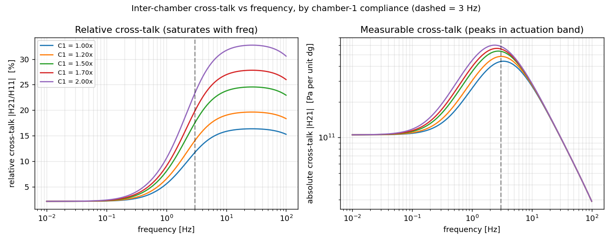
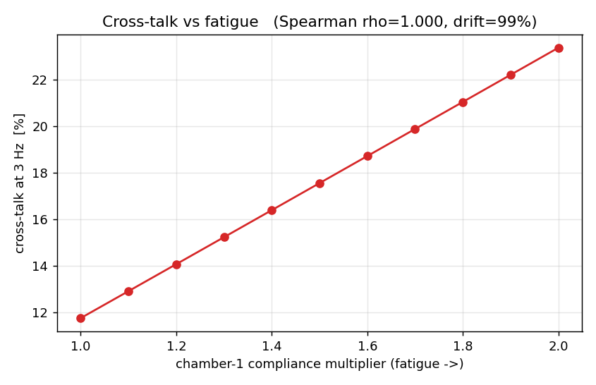
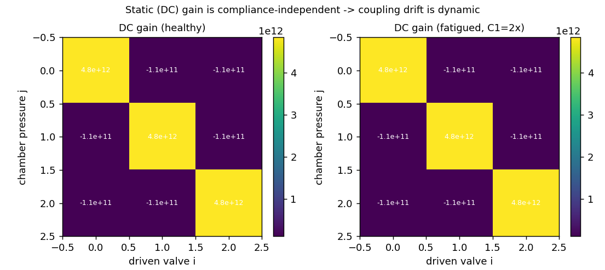

# Gate 0 — Lumped-Parameter Coupling Simulation

**Status:** complete · **Date:** 2026-06-19 · **Verdict: PASS (green-light Week-3 hardware gate)**
**Script:** [`scripts/gate0_lumped_rc.py`](../scripts/gate0_lumped_rc.py) ·
**Artifacts:** [`data/gate0/`](../data/gate0/)

---

## Why this exists

The proposal's whole spine is a single causal chain:

> fatigue → chamber compliance *C₁* ↑ → manifold redistribution gain ↑ → inter-chamber
> cross-talk drifts → pressure-only proprioception degrades.

The original plan tested that chain for the first time at the **Week-3 hardware gate**
— i.e. after fabricating a gripper and a cycling rig. That is the wrong order: the
mechanism is a lumped pneumatic R–C claim and can be pre-tested in software for \$0
*before* any silicone is cast. This is **Gate 0**, and it runs ahead of the hardware
gate. If the coupling does not appear in a clean linear network model, it will not
appear in noisy silicone, and we pivot to the G02 kirigami fallback without spending a
dollar.

## Model

Lumped pneumatic network (Stanley et al. 2021 framework — pneumatic resistance
*R* = d*P*/d*Q*, compliance *C* = d*V*/d*P*):

```
regulated supply --R_s--> manifold node --R_v_i--> chamber_i --R_l_i--> atmosphere
                          (C_m)                    (C_i)
```

- States: three chamber pressures *P₁…P₃* + one manifold node *Pₘ*.
- Chamber *i*: `C_i·dP_i/dt = (P_m − P_i)/R_v_i − P_i/R_l_i`
- Manifold: `C_m·dP_m/dt = (P_s − P_m)/R_s − Σ_i (P_m − P_i)/R_v_i`
- Actuation input *uᵢ* = valve-*i* conductance modulation, linearized about a realistic
  operating point (the standing bleed flow through `R_l` gives the valve authority).
- Output = the three chamber pressures (exactly what a pressure-only pipeline sees).
- **Fatigue** is modeled as chamber-1 compliance rising: *C₁* = *C₀* × multiplier,
  swept 1.0× → 2.0×.

Nominal parameters are PneuNet-class soft pneumatics (R ≈ 10⁸–10⁹ Pa·s/m³,
C ≈ 5×10⁻¹¹ m³/Pa, *P_s* = 0.8 bar), giving a chamber RC corner near **4 Hz** — the
real operating band of Dragon Skin grippers.

## Results

| Finding | Value |
|---|---|
| DC (static) cross-talk change over *C₁* = 1×→2× | **0.0000 %** |
| Cross-talk at 3 Hz vs fatigue, Spearman ρ | **+1.000** (p ≈ 0) |
| Cross-talk relative drift at 3 Hz over the fatigue range | **+99 %** |
| Most fatigue-sensitive frequency (by measurable \|H₂₁\|) | **1.6 Hz** |
| Usable / measurable cross-talk band | **0.3 – 5.7 Hz** |
| Robustness: 400 randomized R/C/P configs, fraction monotone | **100 %** (all positive sign) |
| Robustness: fraction with usable (>10 %) drift | **90 %** |





## What the sim taught us (this changes the experiment)

1. **The spine holds — and it is robust.** Inter-chamber cross-talk rises
   *monotonically* with chamber compliance in 100 % of 400 randomized parameter sets,
   always with the same sign. The coupling is not a fragile artifact of one parameter
   choice; it is structural to a shared-manifold topology. **Green-light the hardware
   gate.**

2. **The coupling is DYNAMIC, not static** — the single most important finding. The
   steady-state (DC) cross-talk gain is *exactly* compliance-independent (the chamber
   and manifold capacitances algebraically cancel out of the static gain). The entire
   fatigue→cross-talk signal therefore lives in the pressure **transients**, governed by
   the RC time constants. Direct consequences:
   - A **static ridge map on instantaneous pressure is blind** to the fatigue→cross-talk
     coupling. The proposal's plan to compare ridge (static) vs ARX/ESN (dynamic) is
     now *predicted by the model*: only the dynamic correctors can see it. This is a
     mechanistic justification, not just an empirical comparison.
   - Quasi-static P–V characterization (de la Morena 2025-style slow inflation) will
     **miss** the coupling. We must probe dynamically.

3. **There is a preferred actuation band (~1–5 Hz).** The *relative* cross-talk
   |H₂₁/H₁₁| saturates with frequency (left figure), but the *measurable* cross-talk
   |H₂₁| — the neighbor-pressure error a pose estimator actually fights — peaks in the
   actuation band and dies off at high frequency (right figure). **Actuate and probe
   near the RC corner (~1–5 Hz for this geometry); do not characterize quasi-statically.**
   The 10 % of randomized configs that gave a weak signal were all ones actuated far
   below their RC corner — confirming the same rule.

## Refined central hypothesis (supersedes Proposal §4)

> As chamber 1 fatigues, its compliance *C₁* rises. On a shared manifold this raises the
> **dynamic** inter-chamber pressure-redistribution gain monotonically, so the measured
> cross-talk coefficients **at actuation-band frequencies (~1–5 Hz)** drift monotonically
> with the P-V compliance feature that signals fatigue — while the **DC coupling stays
> fixed**. The drift is detectable by history-dependent (ARX/ESN) proprioception models
> and invisible to static ones, and appears before pose RMSE exceeds a task threshold.

## What this does NOT prove (honest limits)

- It is a **linear, lumped** model. Real silicone is nonlinear (Mullins, viscoelastic
  creep, large-deformation geometry change). The sim says the coupling *exists and is
  monotone in an idealized network*; it cannot predict magnitude in real hardware, and it
  deliberately omits the Mullins-vs-fatigue confound (the hard experimental problem).
- It assumes fatigue manifests primarily as a **compliance increase**. If fatigue instead
  drives sudden rupture with no precompliance change (see Gate 0b below), the leading-
  indicator value is bounded regardless of what this sim says.
- Cross-talk is modeled via valve-conductance modulation about one operating point; the
  hardware must measure the 3×3 coupling with all valves live across pressure levels
  (Proposal §5.3) to confirm the pressure-dependence the linear model cannot capture.

## Reproduce

```bash
pip install -r requirements.txt
python3 scripts/gate0_lumped_rc.py     # writes data/gate0/{json,3×png}, prints verdict
```

## Next gates

- **Gate 0b (this week, ~\$30):** cycle 2–3 sacrificial actuators and *observe the
  failure mode* — gradual softening/leak vs sudden rupture. This gates contribution #1
  independently of the coupling and is cheaper than any simulation insight.
- **Gate 1 — volume measurement bench test:** prove a clean, repeatable *V* estimate
  exists before trusting any "P-V loop" (see [`Experimental_Protocol.md`](Experimental_Protocol.md)).
- **Week-3 hardware coupling gate:** the original gate, now entered with the mechanism
  pre-confirmed and the actuation band (~1–5 Hz) and feature class (dynamic) chosen for us.
