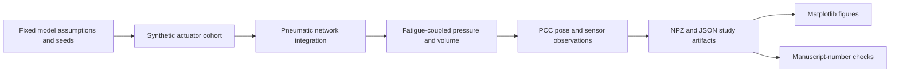

# Data and Figure Provenance

This repository contains generated simulation data rather than physical actuator
measurements. The figure registry covers computational result plots under
`data/gate0/` and `data/sim/`; manuscript PDFs and third-party reference PDFs are
outside its scope.

The machine-readable companion is [`figure-manifest.json`](figure-manifest.json).

## Active summaries and retained history

Every figure under `data/gate0/` and `data/sim/` uses the shared style in
[`scripts/figstyle.py`](../scripts/figstyle.py): three font sizes, one colour per
entity in every figure, a simulation footnote with n and the fixed conditions,
300-dpi PNG and dateless PDF or SVG. Vermillion marks the P-V signal and methods
built on it, blue the cycle-count clock, and grays the reference policies. The
owner asked for this pass on 2026-10-09. Redrawing changed no result; the
[redraw commands](#redraw-every-figure) read saved JSON or rerun a deterministic
script whose JSON output is byte-identical.

The current README and result page use summaries of saved outputs. Regenerate
only these views from the repository root:

```sh
python -m scripts.plot_result_summaries
```

This command reads committed JSON, writes PNG/SVG and full-precision CSV views
under `data/sim/summary/`, and updates the marked policy tables in README and
results. It does not import study runners, regenerate the dataset, fit a model
or change a scientific result. [Input and generator hashes](../data/sim/summary/provenance.json)
record the bytes used. Original JSON remains the numeric source of truth.

| Current visual or table | Source and display choice | Historical material retained |
|:---|:---|:---|
| [Policy comparison](../data/sim/summary/policy_comparison.png), [SVG](../data/sim/summary/policy_comparison.svg), [CSV](../data/sim/summary/policy_comparison.csv) | Matched-cost audit plus saved Study 3 context policies. Aligned error/count panels; linear axes start at zero. Separate rows show the exact tie without covering either marker. | Original trade-off figure omits the matched-cost clock; retained for manuscript reproduction. |
| [Trigger timing](../data/sim/summary/trigger_timing.png), [SVG](../data/sim/summary/trigger_timing.svg), [CSV](../data/sim/summary/trigger_timing.csv) | Saved per-actuator crossing estimates, unchanged order and exclusions. Paired crossings and signed lead use separate axes; connectors are not intervals. | Original dual-axis association figure and generator are retained. Recreating its source trajectories would require dataset regeneration, which this visual task does not perform. |
| [Cross-talk](../data/sim/summary/cross_talk.png), [SVG](../data/sim/summary/cross_talk.svg), [CSV](../data/sim/summary/cross_talk.csv) | Saved resistance/compliance curves, default point and reference thresholds. Same curve selection as the original; log parameter ratio with explicit units. No inferred uncertainty. | Original Study 4 figure remains byte-preserved. |
| README and result policy tables | Generated from the same rows used by the figure. Errors rounded to millimetre thousandths for display; event counts retain fractional cohort means. Full precision remains in JSON and exported CSV. | Manuscript tables and original reported values are unchanged. |
| Study figures under `data/gate0/` and `data/sim/` | Redrawn with the shared style from saved results; same paths, formats and plotted values. | The archived v1.3 PDF and the Preprints.org package in `docs/preprints_submission/` keep the original figures. |

Marker shapes and line styles supplement colour. There are no new error bars or
confidence intervals; intervals appear only where a saved result contains them.
Displayed values were checked against source JSON. `provenance.json` still names
the enclosure commit that set the first layout of these three summaries.

The [separate local metrology figure](decisions/0002-successor-software-preparation.md)
is theoretical and outside this simulation registry. Its local source inputs
and calculation output remain unchanged; its generated sensor table separates
resolution from BFSL accuracy and typical total error band.

## Redraw every figure

Run from the repository root. None of these commands changes a committed JSON
file.

```sh
python -m scripts.gate0_lumped_rc                 # 2 s; rewrites the same gate0_results.json
python -m scripts.phaseA_plant_demo               # 2 s; rewrites the same phaseA_results.json
python -m scripts.phaseB_fatigue_demo --replot
python -m scripts.run_study1 --replot
python -m scripts.run_study2 --replot
python -m scripts.phaseD_dataset                  # 51 s; the next two read the dataset
python -m scripts.run_study3 --replot
python -m scripts.run_study3_cluster_ci --replot
python -m scripts.run_study4                      # 10 s; rewrites the same study4_results.json
python -m scripts.run_studyA                      # 38 s; rewrites the same studyA_results.json
python -m scripts.run_studyB --replot
python -m scripts.run_studyB_structural --replot
python -m scripts.run_studyC --replot
python -m scripts.analyze_studyC_failure --replot
python -m scripts.run_dispersion_audit --replot
python -m scripts.plot_result_summaries
```

`--replot` redraws figures and writes no result files. Most scripts draw from
the saved result. The Study 3 and cluster-interval redraws recompute their
per-actuator curves from the regenerated dataset, and Phase B recomputes its
deterministic curves. A full Phase B run would add a `fatigue_exponent` entry to
`phaseB_results.json`. Full runs of Studies 1, 2 and 3 do not reproduce
their committed JSON byte for byte (see the reproduction caveat in the
[observability program](specs/observability-program/program.md)), so the redraw
does not use them.

## Historical figure reproduction

The commands below reproduce historical studies and can overwrite their outputs.
They are retained for reproducibility and were not run for the figure redraw.

## Data lineage



## Evidence classification

Every registered plot has `evidence_type: simulation`. The generator uses
transparent but assumed fatigue laws, pneumatic parameters, actuator geometry,
and sensor models. Held-out evaluation separates actuator identities generated
by the same model; it does not introduce experimental data.

## Gate 0: pneumatic cross-talk

- **Generator:** `scripts/gate0_lumped_rc.py`
- **Command:** `python -m scripts.gate0_lumped_rc`
- **Method:** lumped R-C pneumatic model with randomized parameter robustness
  cases.
- **Outputs:** coupling versus frequency, compliance, and DC-independence plots
  in `data/gate0/`.

## Phase A: plant consistency

- **Generator:** `scripts/phaseA_plant_demo.py`
- **Command:** `python -m scripts.phaseA_plant_demo`
- **Method:** standard-linear-solid wall and numerical P-V loop calculations.
- **Outputs:** P-V loops, frequency response, and Gate-0 consistency plots in
  `data/sim/phaseA/`.

## Phase B: fatigue trajectory

- **Generator:** `scripts/phaseB_fatigue_demo.py`
- **Command:** `python -m scripts.phaseB_fatigue_demo`
- **Method:** deterministic Mullins, slow-fatigue, accelerating-fatigue,
  recovery, and leak laws from `sim/fatigue.py`.
- **Outputs:** fatigue, recovery, leak, onset, pressure-decay, and P-V loop plots
  in `data/sim/phaseB/`.

## Study 1: indicator checks

- **Generator:** `scripts/run_study1.py`
- **Command:** `python -m scripts.run_study1`
- **Inputs:** synthetic fatigue trajectories, corruptions, and a generated
  validation cohort.
- **Outputs:** detector, recovery, fixture, fusion, and generalization plots in
  `data/sim/study1/`.

## Phase D dataset

`scripts/phaseD_dataset.py` creates the shared dataset used by Studies 2 and 3:

- 20 deterministic synthetic actuators;
- five life fractions;
- isolated and shared supply topologies;
- contact and no-contact cases;
- five repetitions;
- 2,000 traces on a fixed time grid;
- actuator-identity train and held-out partitions.

The generator writes `dataset.npz` and `manifest.json`; the manifest records the
seed, design, actuator table, array shapes, split, and dataset SHA-256.

```bash
python -m scripts.phaseD_dataset
```

## Study 2: drift and correctors

- **Generator:** `scripts/run_study2.py`
- **Command:** `python -m scripts.run_study2`
- **Inputs:** `data/sim/phaseD/dataset.npz` and `manifest.json`.
- **Outputs:** drift and static-versus-dynamic figures plus JSON results.

## Study 3: recalibration policy

- **Generator:** `scripts/run_study3.py`
- **Command:** `python -m scripts.run_study3`
- **Inputs:** the Phase D dataset and manifest.
- **Method:** static ridge calibration, train-selected P-V and clock thresholds,
  and evaluation on held-out actuator identities.
- **Separate health-signal lineage:** `scripts/run_study3.py` calls
  `pipeline/coupling.py::health_trajectory`, which computes analytic SLS loop
  area after `fatigue_state` with zero rest. It does not integrate the noisy,
  quantized, decimated Phase D volume observations. Do not infer Study 3
  health-probe noise or variable-rest robustness from the dataset sensor model.
- **Endpoint:** macro-average of stage-level pose RMSE, then across actuators;
  not maximum or continuously bounded error. Event counts include initialization.
- **Outputs:** the leading-indicator and recalibration-trade-off figures plus
  `study3_results.json`.

The policy plot uses the train-selected clock and omits the matched-cost clock
that coincides with the trigger; see [matched_clock_audit.json](../data/sim/phaseD/matched_clock_audit.json).
Its redrawn footnote points to the matched-cost summary.

## Study 4: network sensitivity

- **Generator:** `scripts/run_study4.py`
- **Command:** `python -m scripts.run_study4`
- **Method:** supply-resistance and manifold-compliance sensitivity sweep.
- **Outputs:** `study4_fig_crosstalk_sensitivity.{png,pdf}` and JSON results.

## Reproduction boundary

Recreating a figure confirms deterministic execution of the committed model and
analysis. It does not validate the model parameters against a physical actuator.

## Study A — dispersion vs indicator invariance (observability program)

- **Generator:** `scripts/run_studyA.py` · **Command:** `python -m scripts.run_studyA` (51 s)
- **Inputs:** `pipeline/dispersion.py` (seed 20260916), `sim/fatigue.py`, `sim/plant.py`, `sim/sensors.py`
- **Outputs:** `data/sim/studyA/studyA_results.json`, `studyA_fig_indicator_spread.(png|pdf)`, `studyA_fig_ablation.(png|pdf)`
- **Preregistration:** `docs/specs/observability-program/studyA-preregistration.md`; verdict field in the JSON.
- **Boundary:** assumed dispersion magnitudes on a synthetic generator; the verdict is about whether this
  cohort can pose the cross-unit question, not about physical actuators.

## Study B — identifiability map (observability program)

- **Generator:** `scripts/run_studyB.py` · **Command:** `python -m scripts.run_studyB` (minutes; 24 sensor repeats per point)
- **Inputs:** `pipeline/identifiability.py`, `pipeline/dispersion.py`, `sim/fatigue.py`, `sim/plant.py`, `sim/sensors.py`
- **Outputs:** `data/sim/studyB/studyB_results.json`, `studyB_fig_identifiability_map.(png|pdf)`
- **Preregistration:** `docs/specs/observability-program/studyB-identifiability.md`.
- **Boundary:** local Cramér–Rao bounds from finite-difference sensitivities of the synthetic generator's
  pressure-only features; a map of where the latent life coordinate is identifiable *in this generator*.

## Study C — unseen-unit transfer (observability program)

- **Generator:** `scripts/run_studyC.py` · **Command:** `python -m scripts.run_studyC` (~4 min)
- **Inputs:** `pipeline/dispersion.py` (seeds 20260916, 20260918), `pipeline/identifiability.py` features, `sim/*`
- **Outputs:** `data/sim/studyC/studyC_results.json`, `studyC_fig_transfer.(png|pdf)`
- **Preregistration:** `docs/specs/observability-program/studyC-transfer.md` (amendment of 2026-09-16 fixes the trajectory design).
- **Boundary:** one estimator on a synthetic dispersed cohort; verdict per the spec's rule; no device claim.

## Study B follow-up — structural vs practical aliasing (observability program)

- **Generator:** `scripts/run_studyB_structural.py` · **Command:** `python -m scripts.run_studyB_structural` (~7 min; `--replot` redraws from the saved result)
- **Inputs:** `pipeline/identifiability.py` (Brun collinearity index, profile likelihood), `pipeline/dispersion.py`, `sim/*`
- **Outputs:** `data/sim/studyB/studyB_structural.json`, `studyB_fig_structural.(png|pdf)`
- **Task:** `literature/gaps.md` item 3.
- **Boundary:** local diagnostics on the synthetic generator. Decides the wording of Study B's finding, not its verdict.

## Dispersion audit — sensitivity to the assumed rupture-life CV (observability program)

- **Generator:** `scripts/run_dispersion_audit.py` · **Command:** `python -m scripts.run_dispersion_audit` (~12 min; `--replot` redraws from the saved result)
- **Inputs:** `pipeline/dispersion.py` (`rupture_cv`, default unchanged), `scripts/run_studyC.py`, `sim/fatigue.py`
- **Outputs:** `data/sim/dispersion_audit/dispersion_audit.json`, `dispersion_audit_fig.(png|pdf)`
- **Task:** `literature/gaps.md` item 1.
- **Boundary:** re-runs the Study C evaluation on cohorts drawn at other dispersions. Changes no committed study output; Study C's verdict and artifacts are untouched.
