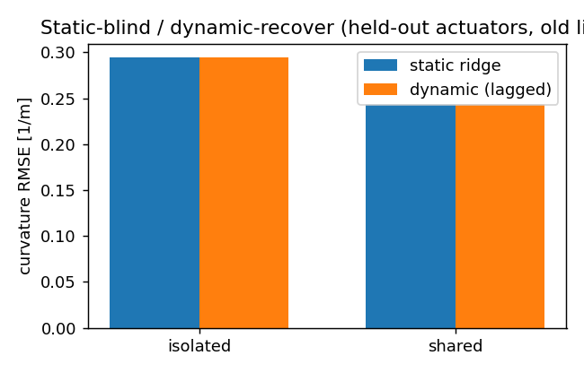
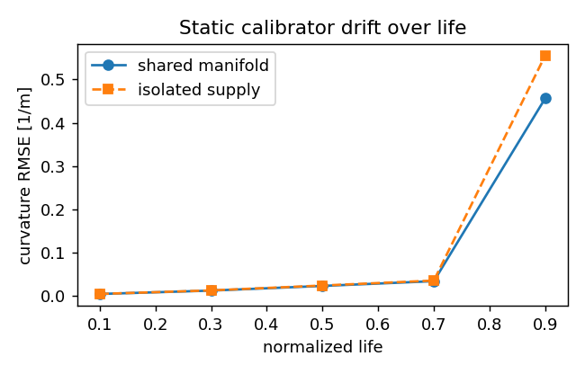
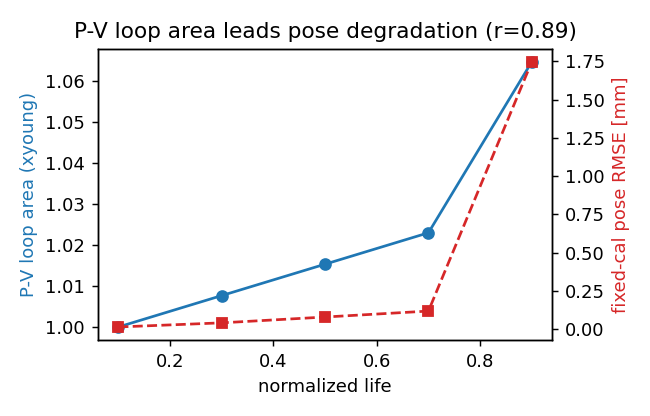
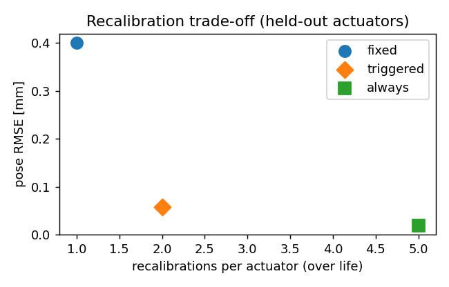
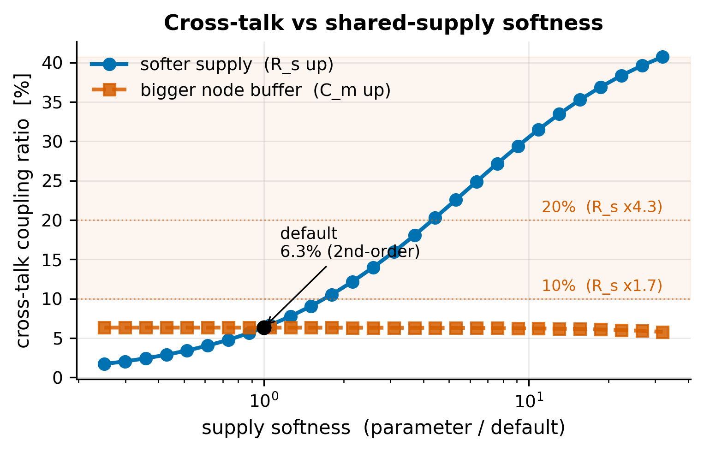

# Pressure–Volume Loop Shape as a Fatigue Leading Indicator for Pressure-Only Proprioception in Shared-Manifold Soft Grippers: A Simulation Study

**Author:** Mergen Ulziibayar · NYU Tandon, Dept. of Mechanical & Aerospace Engineering

**Status:** Draft v1 (2026-06-24). **This is a simulation-only modeling study.** No physical
experiments are reported; every result is synthetic and is labeled as such. Modeling
assumptions are stated as choices, not as calibrated predictions for a physical actuator.

**Venue (decided — a robotics venue; submission not yet authorized).** The target is a robotics
venue. For a simulation/method contribution in soft robotics, **IEEE RoboSoft** is the natural
fit (it accepts modeling/simulation work); **RA-L** becomes appropriate once a physical bench
campaign is added (RA-L typically expects hardware validation). The simulation-only scope and
the single-generator caveat are foregrounded above so the framing matches the venue. **This
manuscript is held as a complete draft and is NOT to be submitted (or otherwise posted
publicly) until an explicit go decision is given.**

---

## Abstract

Soft pneumatic grippers face two coupled deployment problems: silicone chambers fail by cyclic
fatigue, and recovering gripper pose without added sensors relies on the pressure signals
already in the control loop. We study, in simulation, whether the in-loop pressure–volume (P-V)
hysteresis loop can serve as a *leading indicator* of fatigue-driven proprioception degradation
in the practical shared-manifold topology, where chambers share one supply to cut valve count.
We build a transparent, analytically invertible pipeline: a viscoelastic (standard-linear-solid)
pneumatic plant producing rate-dependent P-V loops; a canonical fatigue model (Mullins
softening with partial recovery, irreversible compliance drift, late leak growth);
fatigue-coupled piecewise-constant-curvature (PCC) tip kinematics; a seeded sensor model; and a
shared-manifold-versus-isolated-supply network simulator in which inter-chamber cross-talk lives
in the actuation-band dynamics. From 2,000 labeled traces (20 actuators × 5 life stages × 2
supply topologies × 2 contact states × 5 repetitions), split by **actuator identity**, we
evaluate static and dynamic pressure-only correctors and three recalibration policies.

We report three findings, including a negative one. **(1)** A predicted advantage of a dynamic
(lagged-input) corrector over a static ridge map under the shared manifold **does not
materialize**: the cross-talk is real in the network dynamics but second-order, and the dynamic
corrector improves pose error by ≈0% at physically reasonable parameters. **(2)** The dominant
pressure-only proprioception error is instead the fatigue **compliance-scale drift**, which is
topology-independent and causes a young-calibrated estimator's curvature error to grow by
roughly two orders of magnitude over life. **(3)** The observable P-V loop area is a strong
leading indicator of that drift (Pearson *r* = 0.885, 95% CI [0.835, 0.958] on held-out
actuators), and a P-V-health-triggered recalibration policy holds pose error within a stated
accuracy budget at **60% fewer recalibrations** than an always-on policy (2 vs 5 per actuator),
with the trigger threshold selected on training actuators only. **Scope caveat (stated up
front):** all 20 actuators are drawn from a single generative model, so "generalization to
unseen actuators" tests robustness to that generator, not real device-to-device variation; and
absolute pose errors remain sub-millimeter throughout, so the operational value of triggered
recalibration grows with tighter accuracy requirements.

---

## 1. Introduction

Soft pneumatic grippers are attractive for safe, compliant manipulation, but two monitoring
problems limit their deployment. **Fatigue:** silicone actuators fail by cyclic fatigue, and
current practice detects failure only after rupture or via before/after diagnostics
[Mosadegh 2014; Wong 2026]. **Proprioception:** recovering pose without added sensors uses the
pressure signals already present in the control loop [L. Wang 2020]. Both problems are usually
studied in isolation and, more importantly, under an *independent-chamber* assumption.

The most practical multi-finger topology shares a pneumatic manifold across chambers to reduce
valve count and onboard mass [McDonald 2021; Moran 2024]. On a shared manifold, driving one
chamber's valve perturbs the shared supply node and therefore its neighbors — inter-chamber
**cross-talk**. This paper asks whether, in that topology, fatigue and proprioception are
*physically coupled*: as a chamber fatigues its compliance rises, which (a) changes the P-V loop
shape and (b) could change the cross-talk, so that a single pressure stream might monitor both
health and pose.

We test this coupling in a deliberately transparent simulation, before any hardware. The
modeling choices are made for analytic checkability (noise-free pose is recoverable to machine
precision; isolated supplies give numerically zero cross-talk), and every estimator is validated
against its own ground truth. The contribution of this paper is therefore the **pipeline, the
design outputs, and a pre-registered modeling result framed as a prediction** — not an
experimental claim.

## 2. Related work and prior-art boundary

**P-V hysteresis and fatigue.** P-V hysteresis is *already* used as a before/after fatigue
diagnostic: Mosadegh et al. [2014] assess PneuNet durability across >10⁶ cycles by comparing
P-V curves, and US Patent 10,639,801B2 [Mosadegh, Shepherd, Whitesides 2020] documents the same
before/after protocol. Libby et al. [2023] show the loop shifts with fatigue, and report
FEM-agreement degradation (96%→80%). Hysteresis-loop area as a damage proxy has strong
cross-domain precedent — metals [Haghshenas 2021], flight-control health indicators [Guo 2021],
SHM/acoustic-emission RUL [Galanopoulos 2023] — grounded in early-warning theory [Scheffer 2009]
and the prognostics-pipeline / health-indicator-quality criteria of Lei et al. [2018].
**We therefore do not claim first use of P-V for fatigue.** The boundary is the *cycle-resolved,
operational leading indicator* with quantified lead behavior, separating irreversible drift from
reversible Mullins recovery [Lavazza 2023; Liao 2021; Mars & Fatemi 2002].

**Pressure-only proprioception.** Multi-chamber pressure-only sensing exists [L. Wang 2020;
L. Wang 2023; J. Wang 2025; Joshi & Paik 2023; Zou 2024; Preechayasomboon & Rombokas 2021], but
assumes independent or clean per-chamber supply. The nearest collision is Lindenroth et al.
[2023], which senses contact force on *coupled parallel* chambers but never frames inter-chamber
cross-talk as a proprioception confound or links it to fatigue.

**Shared-manifold modeling.** Lumped resistance–compliance models of pneumatic circuits
[Stanley 2021] provide the tool to model cross-talk as a function of chamber compliance; shared
single-source architectures are common in practice [Moran 2024; McDonald 2021].

**Correctors and recalibration.** ARX/echo-state correctors and physical reservoir computing are
established for pneumatic hysteresis [Jaeger & Haas 2004; Youssef 2022; Shen 2025]. Online
adaptation to soft-sensor drift exists but is *always-on* [Kushawaha 2025; Thuruthel 2022], or
masks anomalous sensors [Sugiyama 2025]; a *fatigue-health-triggered* recalibration is the
contrast we evaluate.

**Ground truth and evaluation.** We follow the soft-proprioception evaluation conventions of
Zhang et al. [2023] and report pose RMSE and contact F1; PCC [Webster & Jones 2010] is treated
as a modeled output, never as measured truth.

## 3. Modeling and methods

The pipeline is implemented in Python (`sim/`, `pipeline/`, `scripts/`) with unit-tested gates
at each stage. All randomness is seeded; the dataset is reproducible from a fixed seed and its
integrity is pinned by a manifest SHA-256.

### 3.1 Viscoelastic plant and P-V loops (Phase A)
Chamber walls are modeled as a standard linear solid (Zener) in the pressure–volume analog: a
spring *k₁* in parallel with a Maxwell arm (*k₂*, relaxation time *τ*). This yields rate-dependent
P-V hysteresis whose dissipation per cycle has the closed form
*E*ₗₒₛₛ(ω) = π *k₂ A²* (ωτ)/(1+(ωτ)²), used as a ground-truth check on the numerical loop area,
and reduces to the linear cross-talk model in the quasi-static limit. *(Validated: Phase A PASS.)*

### 3.2 Fatigue model (Phase B)
A canonical, deterministic life law injects: Mullins softening with a 30% permanent floor and
24-h recovery time constant; irreversible compliance drift; curvature-acceleration onset at 70%
life; and late leak growth (to 20× conductance) observed by a separate closed-valve
pressure-decay probe. Degradation enters the plant as a rising compliance multiplier (softer
*k₁*) and loss multiplier (larger *k₂*). *(Validated: Phase B PASS, synthetic consistency.)*

### 3.3 P-V health features (Phase C)
Causal P-V features, Mullins-recovery normalization, health-index metrics, and matched
false-alarm detectors were validated across a 144-condition identifiability grid; a matched
segmented model recovers the quadratic onset and fails on logistic-onset variants — the intended
inverse-crime/generalization control. *(Validated: Phase C PASS, synthetic.)* Phase C metrics are
applied, not re-validated, downstream.

### 3.4 Fatigue-coupled PCC kinematics (Phase D)
Realized chamber pressure maps to bending curvature through the fatigue compliance multiplier,
κ = κ_gain · *C*(life) · max(*P* − *P*₀, 0), so fatigue *amplifies* curvature at fixed pressure.
Curvature maps to tip SE(3) by the robot-independent PCC convention [Webster & Jones 2010]. The
map is analytically invertible: forward↔inverse round-trips to machine precision, and a
noise-free pose is recoverable exactly (gate test).

### 3.5 Sensor model
A seeded measurement model applies Gaussian noise, quantization, decimation (sampling), and a
contact observation (binary flag + synthetic normal force from tip penetration). Independent
sub-streams per channel make the corruption reproducible and channel-order-independent.

### 3.6 Shared-manifold vs isolated network dynamics
A time-domain integrator drives a focal chamber plus two neighbors. In the **shared** topology
all chambers draw from one supply node; driving one valve pulls the shared node and perturbs the
neighbors. In the **isolated** topology each chamber has its own regulated node and the state
blocks are decoupled. Consistent with a lumped-RC pre-test (Gate 0), the cross-talk is *dynamic*:
its DC gain is compliance-independent while its actuation-band gain drifts with fatigue.
Excitations are multisine in the 1–5 Hz actuation band so the effect is observable. Gate tests
confirm: isolated coupling is numerically zero, shared coupling is measurable, and the
DC-independent / actuation-band-drift property holds.

### 3.7 Dataset
20 actuators × 5 life fractions {0.1,0.3,0.5,0.7,0.9} × 2 topologies × 2 contact states × 5
repetitions = **2,000 traces** (240 time samples each). Per-actuator geometry, wall stiffness,
and rupture life are drawn deterministically. The split is by **actuator identity** (14 train /
6 held-out), never by trace, so generalization is measured on actuators never seen in training.
Features stored per trace include the shared-manifold pressure, all chamber valve commands, the
focal chamber pressure and volume, the true and measured tip positions, the true curvature, and
contact.

### 3.8 Proprioception correctors (Phase E)
The target is focal bending curvature (and, through PCC, tip position) from pressure-only
features [shared-manifold pressure, all chamber commands]. We compare a **static ridge** map
(memoryless) against a **dynamic** corrector that is the identical ridge estimator on
lagged inputs (an exogenous ARX/FIR form; output feedback is excluded because the pose is the
estimation target, not an online measurement). The lag count is the only difference.

### 3.9 P-V health signal and recalibration policies (Phase F)
The health signal is the **observable** P-V loop area from a volumetric probe (the loop-shape
quantity, not the ground-truth compliance), normalized to its young value so the trigger is a
fractional loop-area growth comparable across actuators. Three policies, each starting from one
calibration at the youngest life stage: **fixed** (never recalibrate), **always** (recalibrate
every stage), and **triggered** (recalibrate when fractional loop-area growth since the last
calibration exceeds τ). The threshold τ is selected on **training actuators only** against a
stated accuracy budget, then applied unchanged to held-out actuators. We report estimation error
**and** recalibration count together, so a "savings" cannot hide degraded accuracy.

## 4. Results

### 4.1 Validation gates
All structural gates pass: noise-free pose recovery and forward↔inverse curvature round-trips to
machine precision; isolated-supply off-diagonal coupling at the solver-noise floor (<10⁻⁶) while
shared coupling is measurable (>10⁻⁴); and the Gate-0 property that DC cross-talk is
compliance-independent while actuation-band cross-talk drifts with fatigue. (125 unit tests pass.)

### 4.2 Cross-talk is real but second-order (negative result, retained; Fig. 1)
The proposal predicted that shared-manifold cross-talk drift would be visible to a dynamic
corrector and invisible to a static ridge, making the dynamic corrector win under the shared
manifold. **This does not occur.** With all chamber commands available as features and
per-actuator calibration, the dynamic (lagged-input) corrector improves curvature RMSE over the
static ridge by **≈0% under either topology** (shared: 0.244 vs 0.244 1/m; isolated: 0.295 vs
0.295 1/m; pose ≈0.84 vs 0.84 mm and 1.02 vs 1.02 mm). The cross-talk is genuine in the network
dynamics (§4.1) but is a small perturbation (≈4% of the focal curvature at these physically
reasonable parameters) that does not materially degrade pose estimation. We retain this as a
negative result and did not tune network parameters to manufacture the predicted effect; §5
characterizes the envelope over which it holds by sweeping the supply softness.

*Figure 1. Static vs dynamic (lagged-input) corrector on held-out actuators at old life; the dynamic corrector yields ~0% improvement under either supply topology — the predicted shared-manifold cross-talk advantage does not appear.*

### 4.3 Compliance drift dominates the proprioception error (Fig. 2)
A young-calibrated static estimator's curvature RMSE grows by roughly two orders of magnitude
over life (≈0.004 → ≈0.46–0.56 1/m at 0.9 life), and the shared and isolated curves are
comparable — the difference does not consistently favor the
shared-manifold-degrades-more hypothesis. The dominant pressure-only proprioception error is
therefore the **topology-independent fatigue compliance-scale drift**, not cross-talk. This both
explains §4.2 and motivates recalibration as the right intervention.

*Figure 2. Young-calibrated static estimator curvature RMSE over normalized life (shared vs isolated supply); error grows ~100x by end of life and is comparable across topologies — the degradation is the topology-independent compliance drift, not cross-talk.*

### 4.4 P-V loop area is a leading indicator (Fig. 3)
On held-out actuators, the observable P-V loop-area fractional growth tracks the
fixed-calibration pose error over life with **Pearson *r* = 0.885, 95% CI [0.835, 0.958]**
(bootstrap, 2,000 resamples; CI excludes 0). The observable loop shape leads the proprioception
degradation — the core positive result.

*Figure 3. Observable P-V loop-area growth (left axis) leads the fixed-calibration pose error (right axis) over life on held-out actuators; bootstrap r = 0.885, 95% CI [0.835, 0.958].*

### 4.5 Recalibration trade-off (Fig. 4)
Against a stated 0.159 mm accuracy budget (selected on training actuators as halfway from the
always-on error toward the never-recalibrate error), the trigger threshold τ\* = 0.05 fractional
loop-area growth, selected on training actuators, transfers to held-out actuators as:

| Policy | Pose RMSE (held-out) | Recalibrations / actuator |
|---|---:|---:|
| fixed (never) | 0.40 mm | 1 |
| **P-V-triggered (τ\*=0.05)** | **0.06 mm** | **2** |
| always-on | 0.02 mm | 5 |

P-V-triggered recalibration holds pose error near the always-on band (well inside budget) at
**60% fewer recalibrations** (2 vs 5), and ≈7× better than fixed. Absolute errors are sub-mm in
all policies (see §5), so the demonstrated value is the error-vs-cost trade-off and its transfer
to unseen actuators, not the absolute accuracy.

*Figure 4. Recalibration trade-off on held-out actuators — pose error vs recalibrations per actuator for fixed, P-V-triggered, and always-on policies; the triggered policy meets the accuracy budget at 60% fewer recalibrations than always-on.*

## 5. Discussion and limitations

- **Simulation only.** Every result is synthetic. The pipeline and the modeling result (framed
  as a prediction) are the contributions; no experimental validation is claimed.
- **One generative model.** All 20 actuators come from a single generator, so held-out
  evaluation tests robustness to that generator's variation, not real device-to-device spread.
  This is the first thing a reviewer should weigh and is stated in the abstract.
- **The headline cross-talk hypothesis was not supported.** Cross-talk is monotone in compliance
  (Gate 0) but second-order for pose at realistic parameters. The proposal anticipated this
  "benign coupling" outcome as a publishable floor; the deliverable is the leading-indicator +
  recalibration result via the compliance-drift pathway.
- **Parameter-sensitivity of cross-talk (envelope, Fig. 5).** To make the "second-order" claim a
  characterized regime rather than a single-point assertion, we swept the network parameters that
  set the coupling magnitude and measured the neighbor/driven response ratio at the actuation band
  (`probe_coupling`, `scripts/run_study4.py`). The coupling rises monotonically with supply
  softness: at the default parameters it is **6.3%**, and it crosses the **10%** "starts to matter"
  line only when the supply resistance R_s is **≈1.7×** softer and the **20%** line at **≈4.3×**
  softer. The manifold compliance C_m is a far weaker knob — a larger buffer reduces coupling, and
  across a 128× span (×0.25 to ×32) it stays in the **5.8–6.3%** band and never reaches 10%. So
  the negative result is not knife-edge: cross-talk remains second-order across realistic
  shared-manifold designs and would only become first-order for pose under a deliberately
  under-provisioned (several-fold throttled) supply. A confirmatory corrector check at the softer
  settings is consistent — the dynamic (lagged) corrector still does not beat the static ridge at
  these small-sample sizes, though its penalty shrinks as coupling grows.
- **Sub-millimeter absolute errors.** Even never-recalibrating yields ≈0.40 mm pose RMSE at this
  sensor-noise level, so the operational case for triggered recalibration strengthens with
  tighter pose requirements, softer actuators (larger per-stage drift), or higher noise.
- **Modeling choices.** The fatigue law, PCC single-segment kinematics, and lumped network are
  transparent assumptions chosen for analytic checkability, not calibrated fits.

*Figure 5. Cross-talk coupling ratio (neighbor/driven response at the actuation band) vs shared-supply softness, as a multiple of each default parameter. Coupling rises monotonically with supply resistance R_s and is ≈6.3% at the default operating point (marked); it reaches the 10% and 20% "first-order" lines only at R_s ≈1.7× and ≈4.3× softer. Manifold compliance C_m is a weak knob (stays 5.8–6.3% across ×0.25–×32). The negative cross-talk result holds across realistic shared-manifold designs.*

## 6. Conclusion
In simulation, the observable P-V loop shape is a quantified leading indicator (*r* ≈ 0.89) of
fatigue-driven pressure-only proprioception drift in shared-manifold soft grippers, and a
P-V-health-triggered recalibration policy meets an accuracy budget at a fraction of the
recalibration cost of always-on adaptation, transferring from training to held-out actuators.
The shared-manifold cross-talk, while real, is second-order for pose at realistic parameters — a
retained negative result. The natural next step is a physical bench campaign to anchor the
synthetic story (single-actuator micro-tear spot-check, then the N≈10 fatigue campaign of the
companion proposal).

## 7. Reproducibility
All code, the dataset generator, and the analysis scripts are in the repository. The dataset is
regenerable from a fixed seed (`python -m scripts.phaseD_dataset`; integrity pinned by the
manifest SHA-256); the studies are `python -m scripts.run_study2` (correctors), `python -m scripts.run_study3`
(leading indicator + recalibration), and `python -m scripts.run_study4` (cross-talk
parameter-sensitivity envelope). Frozen result JSON and
figures are committed under `data/sim/phaseD/`; the pre-registered claim and target figures are
in `docs/result_spine.md`. 125 unit tests gate the pipeline.

## References

Citations follow the annotated literature base (`docs/A01_A04_Literature_Review.md`), where full
DOIs are listed. Selected works cited here:

- Mosadegh et al. 2014, *Adv. Funct. Mater.* 24(15):2163–2170. DOI 10.1002/adfm.201303288.
- Mosadegh, Shepherd, Whitesides 2020, US Patent US10639801B2.
- Libby et al. 2023, *ISMR 2023*. DOI 10.1109/ISMR57123.2023.10130227.
- Wong, Luo, Scharff 2026, *Adv. Robotics Research* e202500172. DOI 10.1002/adrr.202500172.
- Mars & Fatemi 2002, *Int. J. Fatigue* 24(9):949–961. DOI 10.1016/S0142-1123(02)00008-7.
- Lavazza, Contino, Marano 2023, *Mech. of Materials* 178:104560. DOI 10.1016/j.mechmat.2023.104560.
- Liao et al. 2021, *Int. J. Mech. Sci.* 206:106624. DOI 10.1016/j.ijmecsci.2021.106624.
- Scheffer et al. 2009, *Nature* 461:53–59. DOI 10.1038/nature08227.
- Lei et al. 2018, *MSSP* 104:799–834. DOI 10.1016/j.ymssp.2017.11.016.
- Haghshenas, Jang, Khonsari 2021, *Mech. of Materials* 155:103734. DOI 10.1016/j.mechmat.2020.103734.
- Guo et al. 2021, *Measurement* 186:110076. DOI 10.1016/j.measurement.2021.110076.
- Galanopoulos et al. 2023, *Eng. Structures* 290:116391. DOI 10.1016/j.engstruct.2023.116391.
- Sugiyama et al. 2025, *Front. Robot. AI* 11:1504651. DOI 10.3389/frobt.2024.1504651.
- L. Wang & Z. Wang 2020, *Soft Robotics* 7(2):198–217. DOI 10.1089/soro.2018.0135.
- L. Wang et al. 2023, *Soft Robotics* 10(4):825–837. DOI 10.1089/soro.2021.0056.
- J. Wang et al. 2025, *Adv. Intell. Syst.* 7(4):2400534. DOI 10.1002/aisy.202400534.
- Joshi & Paik 2023, *Soft Matter* 19. DOI 10.1039/D2SM01197B.
- Zou et al. 2024, *Nature Communications* 15:539. DOI 10.1038/s41467-023-44517-z.
- Preechayasomboon & Rombokas 2021, *Actuators* 10(2):30. DOI 10.3390/act10020030.
- Lindenroth et al. 2023, *IEEE/ASME T. Mechatronics* 28(1):80–91. DOI 10.1109/TMECH.2022.3210065.
- Moran et al. 2024, *Comms. Eng.* 3:117. DOI 10.1038/s44172-024-00251-y.
- McDonald & Ranzani 2021, *Front. Robot. AI* 8:720702. DOI 10.3389/frobt.2021.720702.
- Stanley et al. 2021, *ASME J. Dyn. Sys. Meas. Control* 143(5):051001. DOI 10.1115/1.4049009.
- Jaeger & Haas 2004, *Science* 304(5667):78–80. DOI 10.1126/science.1091277.
- Youssef et al. 2022, *Micromachines* 13(2):216. DOI 10.3390/mi13020216.
- Shen, Miyazaki, Kawashima 2025, *RA-L*, arXiv:2409.06961.
- Kushawaha et al. 2025, arXiv:2503.16540.
- Thuruthel, Gardner, Iida 2022, *Soft Robotics* 9(6):1167–1176. DOI 10.1089/soro.2021.0012.
- Webster & Jones 2010, *IJRR* 29(13):1661–1683. DOI 10.1177/0278364910368147.
- Zhang et al. 2023, *IROS 2023*:2564–2571. DOI 10.1109/IROS55552.2023.10342379.
