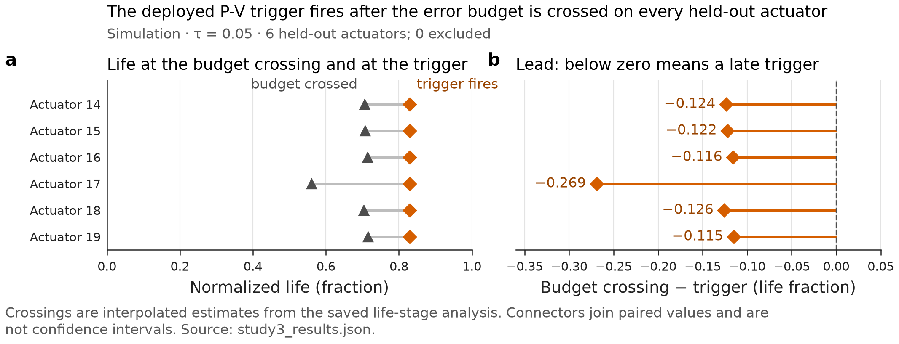
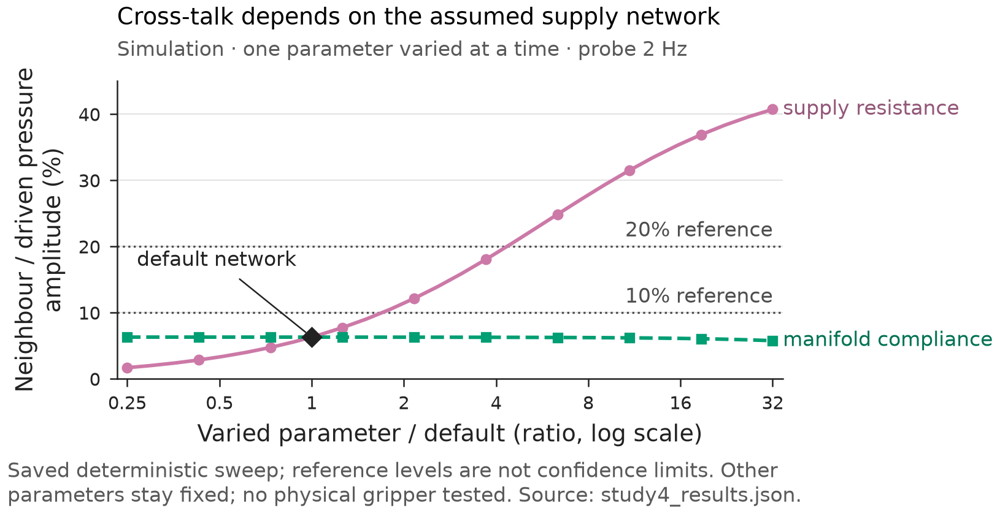

# Results

The simulation study is closed. The [matched-cost audit](../data/sim/phaseD/matched_clock_audit.json)
found that a cycle-count clock ties the P-V trigger, prompting the
[v1.4 withdrawal](corrections/v1.4-withdrawn-2026-10-02.md). The original results
below remain unchanged and synthetic. Archived v1.3 retains its
[methods correction](corrections/v1.3-methods-2026-09-05.md); the
[withdrawn candidate](preprint_v1_4_candidate.md) is kept as a record.

The [successor preparation record](decisions/0002-successor-software-preparation.md)
points to separate local metrology calculations and their theoretical figure.
They contain no new actuator measurements. Historical extensions and assets are
listed in the [history index](history/README.md). The unrun C2 implementation
was removed with the obsolete plans; no executed result was removed. The
[roadmap](../ROADMAP.md) records the adopted dependency order and pending inputs.

## Study 1: health-indicator validation

The study compares candidate health indicators against known synthetic fatigue
state, recovery behavior, onset changes, measurement noise, and held-out
actuator-life trajectories. Its figures are stored under `data/sim/study1/`.

## Study 2: pressure-only proprioception drift

The Phase D cohort shows increasing pose-estimation error when a young
calibration is held fixed as the simulated actuator ages. The study compares
static and dynamic correctors under shared and isolated supply topologies.

## Study 3: recalibration policy

<!-- policy-summary:start -->
| Policy | Mean pose error, RMSE (mm) | Calibrations per actuator |
|:---|---:|---:|
| Initial calibration only | 0.401 | 1.0 |
| Clock: 2,700 cycles (train-selected) | 0.208 | 1.5 |
| Clock: 2,400 cycles (matched cost) | 0.058 | 2.0 |
| P-V trigger: τ = 0.05 | 0.058 | 2.0 |
| Calibration at every stage | 0.019 | 5.0 |
<!-- policy-summary:end -->

Source: [matched-cost audit](../data/sim/phaseD/matched_clock_audit.json) and
[Study 3](../data/sim/phaseD/study3_results.json). [Download full-precision table](../data/sim/summary/policy_comparison.csv).
These are point summaries of saved synthetic results. Counts include initial
calibration; the plot's dashed reference is the train-derived error budget.
No sampling interval is implied by the marker size.

Pooled P-V association: `r = 0.885`, actuator-cluster bootstrap `[0.853, 0.950]`;
leave-one-actuator-out `[0.576, 0.973]`. The point-level interval `[0.835, 0.958]`
is superseded. [Cluster source](../data/sim/phaseD/study3_cluster_ci_results.json).

Actuator-cluster resampling and leave-one-actuator-out sensitivity are already
reported in the committed outputs; point-level inference is superseded.

Study 3's health signal is a separate analytic SLS probe with zero rest input,
not the noisy Phase D volume channel. Noise, quantization and variable-rest
robustness of that signal have not been demonstrated. Shared latent fatigue
drives both endpoints, so correlation is structurally favored. The 2026-10-02 audit found it is stronger than
favored: normalized loop area equals the normalized compliance multiplier to
within 2.3 × 10⁻¹⁴ and is the same curve for every actuator.

The policy endpoint averages stage-level pose RMSE over five sampled life stages
and then actuators. A pass is not a maximum-error or continuous accuracy guarantee.
The 60% event-count saving includes initial calibration; sensing overhead and
recalibration downtime were not measured.

Each row pairs one actuator's saved crossing estimates. Lead is budget-crossing
life minus trigger life; the zero line separates advance warning from lateness.
Connectors join paired values and are not intervals. The values are interpolated
from the saved life-stage analysis, with no new trajectories or exclusions.
[Download records](../data/sim/summary/trigger_timing.csv) · [Source](../data/sim/phaseD/study3_results.json).

The manuscript [association figure](../data/sim/phaseD/study3_fig3_leading_indicator.png)
and [unmatched-clock policy plot](../data/sim/phaseD/study3_fig4_recal_tradeoff.png)
are redrawn from the saved Study 3 result. The association curve is generated by
the shared fatigue law; the policy plot omits the matched-cost clock.
Neither supports a physical precursor claim.

## Study 4: shared-manifold sensitivity

Shared-manifold cross-talk is second-order within the tested network envelope
and increases as the simulated supply becomes softer. The result is conditional
on the lumped pneumatic-network parameters and is not a measurement of a
physical gripper.

The horizontal references retain the original sweep thresholds. Lines join saved
deterministic model outputs, with no uncertainty band. The logarithmic horizontal
axis shows the varied parameter divided by its default, with all other parameters
fixed. [Download ratios](../data/sim/summary/cross_talk.csv) · [Source](../data/sim/phaseD/study4_results.json).
The [manuscript figure](../data/sim/phaseD/study4_fig_crosstalk_sensitivity.png)
shows the same sweep.

## Result sources

- Study JSON and figures: `data/sim/`
- Frozen claim ledger: [`result_spine.md`](result_spine.md)
- Figure-generation lineage: [`data-and-figures.md`](data-and-figures.md)
- Manuscript-number checks: `scripts/check_manuscript_numbers.py`

## Observability program — Studies A and B (2026-09-16, synthetic, preregistered)

[Program](specs/observability-program/program.md) · [evidence](../evidence/observability-2026-09-16/README.md).
Question: is the fatigue state observable from pressure alone across dispersed units?

- **Study A** (30 units with assumed dispersion of the degradation law and plant): the normalised loop-area
  indicator's between-unit spread is 5–17× its measurement noise from mid-life (ICC 0.98), so the value is no
  longer unit-invariant; only degradation-law dispersion produces this, plant-level dispersion cancels under
  young-normalisation. The trigger life at τ = 0.05 still spreads by only 0.044 life, so the preregistered
  verdict is **A-FAIL** on its timing criterion and Study C stays blocked.
- **Study B** (Cramér–Rao bounds on the latent life coordinate from five pressure-only features): with a young
  baseline the coordinate is identifiable before the acceleration onset (σ_u ≈ 0.02–0.03 life, scaling with
  noise/amplitude) and only **practically** aliased after it, with the unit's onset fraction and leak.
  Verdict **B-PASS** by its rule; the regime boundary is the result. A follow-up on 2026-09-23 ran the
  two diagnostics the literature prescribes and corrected the wording: Brun's collinearity index puts the
  {life, onset, leak} *triple* at 1.25e6 against 60.8 and 5.83 for the pairs, confirming a joint dependency
  no pairwise measure shows. The profile-likelihood half of that follow-up was wrong and was redone on
  2026-09-25. Under the baseline-plus-snapshot design the post-onset coordinate is neither structurally
  nor practically aliased, but it is **not precisely localized either**: the data support a broad,
  asymmetric region of roughly [0.75, 0.98] in one noise realisation, the likelihood varies by 6e-10
  across most of that span, and both terminations sit on nuisance-parameter bounds. Widening those bounds
  to a still-physical range removes the upper termination **entirely**, so the crossing was the box talking
  and the verdict is bound-dependent. **No resolution figure is claimed** — both the earlier "±0.05 life" and the interim "±0.21 life" are withdrawn, the first read
  off a grid edge and the second off a plateau ending at the parameter box. The minimum sits at 0.775
  against a truth of 0.90, an observed error in this one realisation, not a measured bias. A single aged
  snapshot without the modelled young baseline localises less well still.
  [Evidence](../evidence/studyB-structural-correction-2026-09-25/README.md).

- **Study C** (one ridge estimator on baseline-normalised pressure features plus the clock, transferred to 10
  held-out units; run after the owner withdrew Study A's timing criterion): mean held-out u-RMSE 0.093 vs 0.123 for
  the clock alone, but only 6 of 10 units within 0.10 and 7 of 10 below the clock, so the preregistered verdict is
  **C-FAIL**. The estimator helps exactly where the clock's rupture prior is wrong (short-lived units) and adds
  little where it is right; no transfer claim. A dispersion audit on 2026-09-23 re-ran this at rupture-life
  CV 0.05 and 0.15, bracketing the values measured in the literature, and found **C-FAIL survives at every
  level but for opposite reasons**: at CV 0.05 the estimator is accurate (10/10 within target) yet a bare
  cycle counter beats it (2/10), while at CV 0.30 it beats the clock (7/10) but is no longer accurate (6/10).
  The two criteria move in opposite directions, and the per-unit rule is the same throughout — pressure
  features add value only where the clock prior is wrong for that unit.
  [Evidence](../evidence/dispersion-audit-2026-09-23/README.md).

Boundary: one synthetic generator, assumed dispersion magnitudes, local bounds; no physical claim.
